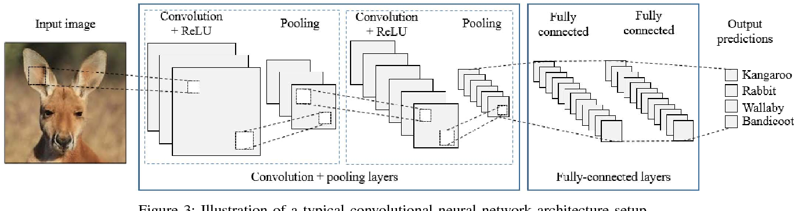

# Wild Animal Image Classification

*Animal Image classfication [Source](https://www.semanticscholar.org/paper/Animal-Recognition-and-Identification-with-Deep-for-Nguyen-Maclagan/013d7818f456c95bd0cd6dd4a5ffa4a2c5af41df/figure/2)*

## In this repositery we are building a wild animal image classification model with different machine learning algorithms to find out the best model we can get.
- We are using the [Wild animal image classification Dataset](https://www.kaggle.com/datasets/whenamancodes/wild-animals-images) from Kaggle.
- We will understand different things like Data augmenation, Transfer learning etc.
- We will perform experiments with different model like SVM,KNN, CNN etc.
- We will bulild a web application to serve our model as a product.
- We will also consider experimenation tracking with MLflow.

__Please open how-to-run.md to look steps to run the experiments on google colab.__

It's recommended to start with this [Medium blog post]([https://medium.com/@yogesh.grjr4/naive-bayes-classification-7a0b27201481](https://medium.com/@yogesh.grjr4/wild-animal-image-classifier-78037713f593))

